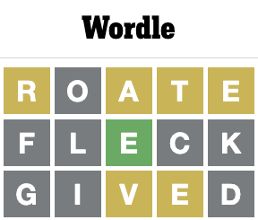
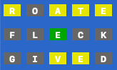
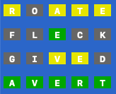

# `wordtl`

`wordtl` is a `tool` that helps `anyone` to `solve a Wordle`, `guess a word from a dictionary`, or `search a dictionary` .

`wordtl` includes the Wordle list (of 5 letter words) from https://www.nytimes.com/games/wordle/index.html that are stored in this [repo](./words/wordle_words.go). Optionally, `wordtl` can read a word file (an ASCII text file with one word per line) to use as its dictionary. See [Specify Your Own Word List](#specify-your-own-word-list) for more details.

## Use Cases
`wordtl` is a powerful search engine that provides answers for finding a word in a dictionary with the same number of letters.

### 1. TLDR; Just Play Wordle - Play Along Mode!
Here's a [quickstart to get you going with Wordle using the `auto` subcommand](#tldr-just-play-wordle) in `wordtl` play-along mode that will walk you through a game of Wordle and help you with the next guess.

### 2. Guess and Result to Create Search Patterns
[Enter Guesses and Results one at a time using the `manual` subcommand](#generate-search-terms-from-guess-and-result) is an example of how to use `wordtl` to simplify in the process of creating search patterns.

### 3. Search Patterns
[Invoke `wordtl` with search parameters using the `search` subcommand](#search-example) to help you find a list of words that meet your criteria. For example:
- What is a list of 5 letter words that have:
  - "T" as the first letter, and
  - "R" is not in postion 2,
  - "IES" are excluded.

## Prerequisites

Not much here. You can run `wordtl` on `Windows or Mac`.

If you would like to compile, test, and build the code then you will need `Golang` installed. See [How to Build and Test the Source Code](#buildingtesting-wordtl)

## Installing `wordtl`

To install `wordtl`, follow these steps:

macOS:
```
copy "wordtl" to your machine
# to make it executable
chmod 775 wordtl 
```

Windows:
```
copy "wordtl.exe" to your machine
```
### Word Lists
By default, `wordtl` uses `Wordle` words from https://www.nytimes.com/games/wordle/index.html. The default word length is 5.

#### Specify Your Own Word List
Optionally, `wordtl` can read a word file (an ASCII text file with one word per line) to use as its dictionary. `CSW21.txt` is an example that could be placed in the same directory as `wordtl` (for macOS) or `wordtl.exe` (for Wndows) and then consumed with the `-file` arg. It can be downloaded from https://ia903406.us.archive.org/31/items/csw21/CSW21.txt. 
- Ensure that a word file (an ASCII text file with one word per line) is downloaded and avaiable for wordctl to read if the `-file` arg is specified.
- CSW21.txt is the same as CSW22.txt from https://www.dropbox.com/s/gagbzhzbe2900ua/CSW22.txt and is described by the Collins Coalition here: https://www.cocoscrabble.org/lexicon.

## Using `wordtl`

To use `wordtl`, follow these steps:

macOS:
```
cd <dir that contains wordtl>
./wordtl
```

Windows:
```
cd <dir that contains wordtl.exe>
wordtl.exe
```

### Usage:
`wordtl` uses subcommands to perform the different functions. Here is the subcommand `help`:
```
./wordtl help     

usage: ./wordtl subcommmand [flags]

Available subcommands:
   auto     Auto Play: Try to guess the word in 6 tries
   manual   Manual Guess: Get help with a single guess
   search   Search All Words: dictionary lookup
   help     Print subcommand help message

For specific subcommand flags, enter './wordtl subcommmand -h'

Also see https://github.com/scottballenger/wordtl/blob/main/README.md for a
detailed description.

```
#### Global Flags
`wordtl` has the following `global` flags:
```
  -file string
      OPTIONAL Word File: Name/Path of ASCII text file containing one word per
      line. Will use the Wordle list from 
      https://www.nytimes.com/games/wordle/index.html if this flag is not
      specified.
  -length int
      Word Length: Number of letters in each word. Wordle is 5 letters.
      (default 5)
  -max-print int
      Max Words to Print. (default 100)
  -stats
      Print statistics of letter distribution for each letter position.
```
#### Search Flags

```
  -exclude-all string
      Excluded Letters: Letters that cannot appear in the word. Example value
      of 'ies' means that 'i', 'e', or 's' cannot appear anywhere in the word.
  -exclude-pos string
      Excluded Letters by Position: Letters that cannot appear in a specific
      position of the word. JSON - Example value of '{"1":"ab","4":"cd"}' means
      that 'a' or 'b' cannot appear in position #1 of the word and 'c' or 'd'
      cannot appear in position #4 of the word. Position must be an integer
      greater than or equal to 1 and should be less than or equal to the word
      length.
  -file string
    	OPTIONAL Word File: Name/Path of ASCII text file containing one word per
      line. Will use the Wordle list from 
      https://www.nytimes.com/games/wordle/index.html if this flag is not
      specified.
  -length int
    	Word Length: Number of letters in each word. Wordle is 5 letters.
      (default 5)
  -max-print int
    	Max Words to Print. (default 100)
  -pattern string
    	Pattern to Match: Known letters will be in the position that they appear.
      Wildecard placeholders '-' 1) must include all letters specified by the
      -wildcards flag and 2) can be any other letter that is not excluded by
      the -exclude-all flag. Example value of 't----' would lookup words with a
      't' in the beginning of a 5 letter word.
  -stats
    	Print statistics of letter distribution for each letter position.
  -wildcards string
    	Wildcard Letters: Letters that must appear in any position where there is
      a wildecard placeholder '-'. Example value of 'r' means that there must
      be at least 1 'r' in any place where there is a '-' in the -pattern flag.
```

## Search Example
### Example Input
What is a list of 5 letter words that have:
  - "T" as the first letter, and
  - "R" is not in postion 2,
  - "IES" are excluded.

Would be specified by `./wordtl search -pattern t---- -wildcards r -exclude-pos '{"2":"r"}' -exclude-all ies`

### Example Output
The Example input has the following output:
```
Search All Words: dictionary lookup

Word length: 5
Word pattern: 't----'
Wild Card letters: 'r'
Excluded letters: 'ies'
Can't use letters in postion #2: 'r'
Using built-in Wordle words.
Ignoring built-in Wordle solution words.

SEARCH ALL WORDLE WORDS (40):
tabor talar tardo tardy targa tarka taroc tarok tarot tarry tarty tarzy tatar
taxor tayra tharm thorn thoro thorp thraw throb throw thrum thurl tolar torah
toran torch torot torta tuart tubar tugra tumor turbo turfy turnt turon tutor
tyran 
```

### I didn't get any results?
You specified to many required items and nothing matched your query. Simply remove some of the constraints to open the query to more results.

## TLDR; Just Play Wordle
If you just want to play Wordle and get all of the advantages of `wordtl` right away, just use the `Auto Play` mode using the `auto` subcommand.

This will allow you to enter guesses in the Wordle UI, and come up withthe next guess based on the remaining words. Here's an example when the solution was `AVERT`

### `Wordle` Solution Words
`Wordle` allows many words when geussing (entering a value in the UI) `Today's Wordle` - we will call this set of words `all-words`. `Wordle` has curated a subset of `all-words` that can be `Today's Wordle` - we will call this set of words `solution-words`. Here's the differences:
- `all-words` - Most 5 letter scrabble words from something like `CSW21.txt` or `CSW22.txt` as described in https://www.cocoscrabble.org/lexicon. 
  - This consists of approximately 15,000 words that can be used to `guess` in `Wordle` and eliminate as many words as possible.
  - Most of these are uncommon words that you never really use - but they are legal words for making a `guess`.
- `solution-words` - Curated subset of `all-words` that the `Wordle` team has chosen as the actual `Today's Wordle` answer.
  - This consists of approximately 2,300 words that are the actual answer for `Today's Wordle`.
  - The `default` mode for `wordtl` is to ONLY use the `solution-words` as the final answer. 
    - This can be changed by specifying the `-ignore-wordle-solution-words` flag. In this case `all-words` will be considered as the final answer.
    - In cases where `wordtl` cannot find the final answer in the `solution=-words`, the program will prompt the user to use `all-words` instead.

### Eliminating Previous Results
For the most part, `Wordle` does not recycle previous results. In order to provide the best solution, `wordtl` stores/retrieves the previously used `Wordles` in a file - [wordle_words_used.txt](./words/wordle_words_used.txt).
- These words are also published at https://www.rockpapershotgun.com/wordle-past-answers.

By `default`, `wordtl` removes these words from the `solution-words` when determining the final solution.
- The `-ignore-wordle-used-words` flag can be specified to consider all `solution-words` for the final answer.

After each successful solution of a `Wordle`, the option is given to save the latest result in [wordle_words_used.txt](./words/wordle_words_used.txt) for future use.
```
Would you like to add 'avert' to the list of already used words? (default = 'y', exit = '0'): <enter>
```
The next time `wordtl auto` is run, then 'avert' will not be considered in the `solution-words`.

### Entering Results From Wordle UI
Here's an example play from the Wordle UI. We'll use it as an example on how to enter guess results. To get to the solution `AVERT`, the following guesses were used:


The following nomenclature are used to mimic the results from the Wordle UI:
```
'=' for matching characters, <a green box>
'-' for matching characters that are in the wrong location, <a yellow box> 
'x' for non-matching characters. <a gray box>
```

So, in the case of `ROATE` input we would create an result string of `-x---`, and for `FLECK` we would answer `xx=xx` to indicate the response from the Wordle UI.

In the case of `ROATE` and `-x---`, `wordtl` will give the following feedback to ensure that your `result` matches the Wordle UI:


You want to make sure the color/letter combinations match what is displayed in the Wordle UI above.

This is the primary feedback for `wordtl` to help you figure out your next guess.

### Play Along with Wordle UI
In this example, we take the recommended guess from `wordtl` by accepting the default `guess` for each turn.

For more details on the information printed out by `wordtl`, please see [Interpreting the Output](#interpreting-the-output).

Enter `./wordtl auto`

```
Auto Play: Try to guess the word in 6 tries

Word length: 5
Using built-in Wordle words.
Using built-in Wordle solution words.

MATCHING WORDS (2309):
Only printing first 100
aback abase abate abbey abbot abhor abide abled abode abort about above abuse
abyss acorn acrid actor acute adage adapt adept admin admit adobe adopt adore
adorn adult affix afire afoot afoul after again agape agate agent agile aging
aglow agony agree ahead aider aisle alarm album alert algae alibi alien align
alike alive allay alley allot allow alloy aloft alone along aloof aloud alpha
altar alter amass amaze amber amble amend amiss amity among ample amply amuse
angel anger angle angry angst anime ankle annex annoy annul anode antic anvil
aorta apart aphid aping apnea apple apply apron aptly arbor 

Try these letters (26):
e=1230 a=975 r=897 o=753 t=729 l=716 i=670 s=668 n=573 c=475 u=466 y=424 d=393 h=387 p=365 m=316 g=310 b=280 f=229 k=210 w=194 v=152 z=40 x=37 q=29 j=27 

Trying elimination letters: 'earotlisncuydhpmgbfkwvzxqj'

BEST ELIMINATION WORDS (3):
oater orate roate 

BEST ELIMINATION WORD - BEST CHOICE! - 'roate'

TRY #1
------

Enter your Guess (default = 'roate', exit = '0'): <enter>
Enter your Result (exit = '0'): -x---<enter>
```


```
Is this correct? (default = 'y', exit = '0'): <enter>

MATCHING WORDS (17):
after alert alter avert cater eater extra great hater later taker tamer taper
terra tread treat water 

Try these letters (12):
l=3 f=1 g=1 v=1 m=1 h=1 p=1 d=1 w=1 c=1 k=1 x=1 

Trying elimination letters: 'lckxgvmhpdfw'

BEST ELIMINATION WORDS (37):
chalk chawl chelp child clamp clomp clump delph dwalm felch filch flack fleck
flick flimp flock flump glamp glyph gulch gulph lymph melch milch mulch pelch
phlox pilch plack pleck plock pluck welch whelk whelm whelp whilk 

BEST ELIMINATION WORD - BEST CHOICE! - 'fleck'

TRY #2
------

Enter your Guess (default = 'fleck', exit = '0'): <enter>
Enter your Result (exit = '0'): xx=xx<enter>
```


```
Is this correct? (default = 'y', exit = '0'): <enter>

Result after 2 guesses:
```

```
MATCHING WORDS (4):
avert great tread treat 

Try these letters (3):
d=1 g=1 v=1 

Trying elimination letters: 'gvd'

BEST ELIMINATION WORDS (4):
gived goved gyved vadge 

BEST ELIMINATION WORD - BEST CHOICE! - 'gived'

TRY #3
------

Enter your Guess (default = 'gived', exit = '0'): <enter>
Enter your Result (exit = '0'): xx--x<enter>
```


```
Is this correct? (default = 'y', exit = '0'): <enter> 

Result after 3 guesses:
```

```
MATCHING WORDS - EXACT MATCH! - 'avert'

Using MATCHING WORD - 'avert'

TRY #4
------

Enter your Guess (default = 'avert', exit = '0'): <enter>
Enter your Result (exit = '0'): =====<enter>
```


```
Is this correct? (default = 'y', exit = '0'): <enter>

Congratulations, you have found the solution word in 4 turns!
```


## Generate Search Terms From Guess and Result
Instead of entering all of the specific parameters manually (-pattern t---- -wildcards r -exclude-pos '{"2":"r"}' -exclude-all ies) to do a search, `wordtl` can automatically generate them for you using the Guess (`-guess`) and Result (`-guess-result`) arguments.

### Guess/Result
The example `What is a list of 5 letter words that have: "T" as the first letter, and "R" is not in postion 2, and "IES" are excluded` came from trying to guess `tries` in Wordle. The result from Wordle was that "T" is a match in position, "R" is in the word but not in position 2, and "IES" do not match.

So, one could input the following to tell `wordtl` the same thing.

```
./wordtl manual -guess tries -guess-result '=-xxx'
```
is equivilant to manually entering
```
./wordtl manual -pattern t---- -wildcards r -exclude-pos '{"2":"r"}' -exclude-all ies
```
### Guess/Result Example
```
NOTE: The `-ignore-wordle-used-words` flag has been specified in this example
to produce consistent results.
```

#### Try #1

Input:
```
./wordtl manual -ignore-wordle-used-words
```
Output:
```
Manual Guess: Get help with a single guess

Word length: 5
Guess:  ''
Result: ''
Using built-in Wordle words.
Using built-in Wordle solution words.

MATCHING WORDS (2309):
Only printing first 100
aback abase abate abbey abbot abhor abide abled abode abort about above abuse
abyss acorn acrid actor acute adage adapt adept admin admit adobe adopt adore
adorn adult affix afire afoot afoul after again agape agate agent agile aging
aglow agony agree ahead aider aisle alarm album alert algae alibi alien align
alike alive allay alley allot allow alloy aloft alone along aloof aloud alpha
altar alter amass amaze amber amble amend amiss amity among ample amply amuse
angel anger angle angry angst anime ankle annex annoy annul anode antic anvil
aorta apart aphid aping apnea apple apply apron aptly arbor 

Try these letters (26):
e=1230 a=975 r=897 o=753 t=729 l=716 i=670 s=668 n=573 c=475 u=466 y=424 d=393 h=387 p=365 m=316 g=310 b=280 f=229 k=210 w=194 v=152 z=40 x=37 q=29 j=27 

Trying elimination letters: 'earotlisncuydhpmgbfkwvzxqj'

BEST ELIMINATION WORDS (3):
oater orate roate 

BEST ELIMINATION WORD - BEST CHOICE! - 'roate'

Try:
./wordtl manual -ignore-wordle-used-words -pattern ----- -guess roate -guess-result 
```
#### Interpreting the Output

##### `Matching Words`
This is a list of words that match the input criteria. `The answer is in here!`

##### `Try these letters`
This is a list of letters in the `MATCHING WORDS` in the order of their occurrances (greatest to least) that WERE NOT included in the search. 

##### `[Best] Elimination Words`
`wordtl` will try and come up with a word, or list of words, that will disambiguate the remaining `MATCHING WORDS`. `wordtl` will display the best matches (having as many elimination letters as possible) chosen from the dictionary as good elimination words.

##### `BEST ELIMINATION WORD`
`wordtl` will select a single word as the `BEST CHOICE` to narrow the remaining `MATCHING WORDS` as mush as possible. This is should be the next `GUESS` to try and solve the `Wordle`.

#### Try #1 Guess
`wordtl` is telling us to use `roate` as a starter word in Wordle. In this case, we'll just accept the best choice recommended by `wordtl`

Enter `roate` into the Wordle UI, and we get:


#### Try #2
Now we take the feedback from the Wordle UI and code it into the result (`-guess-result`) using the argument value from above:
```
'=' for <green> matching characters, 
'-' for <yellow> matching characters that are in the wrong location, 
'x' for <gray> non-matching characters.
```
and we get:
```
-guess-result -x---
```
and we have the following Input:
```
./wordtl manual -ignore-wordle-used-words -pattern ----- -guess roate -guess-result -x---
```
Output:
```
Manual Guess: Get help with a single guess

Word length: 5
Word pattern: '-----'
Guess:  'roate'
Result: '-x---'
Using built-in Wordle words.
Using built-in Wordle solution words.

MATCHING WORDS (17):
after alert alter avert cater eater extra great hater later taker tamer taper
terra tread treat water 

Try these letters (12):
l=3 g=1 c=1 v=1 w=1 k=1 m=1 h=1 p=1 d=1 f=1 x=1 

Trying elimination letters: 'lgcvwkmhpdfx'

BEST ELIMINATION WORDS (37):
chalk chawl chelp child clamp clomp clump delph dwalm felch filch flack fleck
flick flimp flock flump glamp glyph gulch gulph lymph melch milch mulch pelch
phlox pilch plack pleck plock pluck welch whelk whelm whelp whilk 

BEST ELIMINATION WORD - BEST CHOICE! - 'fleck'

Try:
./wordtl manual -ignore-wordle-used-words -pattern ----- -wildcards rate -exclude-pos '{"1":"r","3":"a","4":"t","5":"e"}' -exclude-all o -guess fleck -guess-result
```
Enter `fleck` into the Wordle UI, and we get:


#### Repeat
Repeat until a solution is arrived at as follows:
``` 
# Try #3
./wordtl manual -ignore-wordle-used-words -pattern ----- -wildcards rate -exclude-pos '{"1":"r","3":"a","4":"t","5":"e"}' -exclude-all o -guess fleck -guess-result xx=xx

Try:
./wordtl manual -ignore-wordle-used-words -pattern --e-- -wildcards rate -exclude-pos '{"1":"r","3":"a","4":"t","5":"e"}' -exclude-all oflck -guess gived -guess-result 

# Try #4
./wordtl manual -ignore-wordle-used-words -pattern --e-- -wildcards rate -exclude-pos '{"1":"r","3":"a","4":"t","5":"e"}' -exclude-all oflck -guess gived -guess-result xx--x

Try:
./wordtl manual -ignore-wordle-used-words -pattern --e-- -wildcards ratev -exclude-pos '{"1":"r","3":"av","4":"te","5":"e"}' -exclude-all oflckgid -guess avert -guess-result
```

and then we have success!


## Building/Testing `wordtl`
`wordtl` is developed in Golang. You will need to download Golang from https://golang.org/doc/install. You can install additional developer tools such as an IDE if you would like, but it is not required.

### TLDR;
Run [build-all](./build-all) to build all executables and run unit tests.

### Golang Version
This code was compiled with `go version go1.22.1 darwin/amd64`. Run `go version` to see what you are using.

### Compile the Code and Build Executables

To build the code and create the stand-alone executable for your platform, just run the following command:

```
cd wordtl
go build
```

macOS:
This will create the executable `wordtl` that you can run.

Windows:
This will create the executable `wordtl.exe` that you can run.

#### Compiling the Code for other Platforms

For the complete list of operating systems and architectures that can be cross compiled, see https://golang.org/doc/install/source#environment

##### Compiling for Windows from macOS

If you are on a macOS platform and want to create an executable for Windows, then you would run the following:

```
cd wordtl
GOOS=windows go build
```

This will create the executable `wordtl.exe` that you can run on Windows.

##### Compiling for macOS from Windows

If you are on a Windows platform and want to create an executable for macOS, then you would run the following:

```
cd wordtl
GOOS=darwin go build
```

This will create the executable `wordtl` that you can run on macOS.

### Run Unit Tests

To run the unit tests for your platform, just run the following command:

```
cd wordtl
go test ./...
```

Upon execution, you should see something that ends with:
```
?       wordtl  [no test files]
ok      wordtl/words    0.447s
```

## Contributing to `wordtl`
To contribute to `wordtl`, follow these steps:

1. Fork this repository.
2. Create a branch: `git checkout -b <branch_name>`.
3. Make your changes and commit them: `git commit -m '<commit_message>'`
4. Push to the original branch: `git push origin wordtl/<location>`
5. Create the pull request.

Alternatively see the GitHub documentation on [creating a pull request](https://help.github.com/en/github/collaborating-with-issues-and-pull-requests/creating-a-pull-request).


## License

This project uses the following license: [MIT License](https://github.com/scottballenger/wordtl/blob/main/LICENSE).