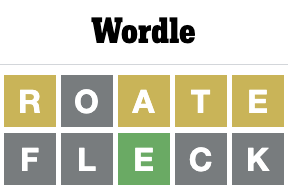
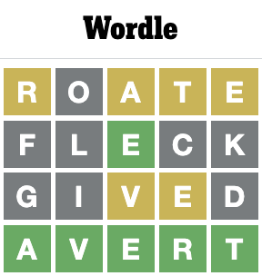

# `wordtl`

`wordtl` is a `tool` that allows `anyone` to `help them solve a Wordle`, `Living Wordle`, or guess a word from a dictionary.

`wordtl` includes the Wordle lists (5 letter words) from https://www.nytimes.com/games/Wordle/index.html and Living Wordle from https://www.thelivingwordle.com that are stored in this repo. Optionally, `wordtl` can read a word file (an ASCII text file with one word per line) to use as its dictionary.

## Use Cases
`wordtl` is a powerful search engine that provides answers for finding a word in a dictionary with the same number of letters.

### Search Patterns
Invoke `wordtl` with search parameters to help you find a list of words that meet your criteria. For example:
- What is a list of 5 letter words that have:
  - "T" as the first letter, and
  - "R" is not in postion 2,
  - "IES" are excluded.

### Solve Wordle or Living Wordle
Below in the section [Easier Way](#easier-way) is an example of how to use `wordtl` to solve a Wordle using the Wordle UI.

## Prerequisites

Not much here. You can run `wordtl` on `Windows or Mac`.

If you would like to compile, test, and build the code then you will need `Golang` installed.

## Installing `wordtl`

To install `wordtl`, follow these steps:

macOS:
```
copy "wordtl" to your machine
# to make it executable
chmod 775 wordtl 
```

Windows:
```
copy "wordtl.exe" to your machine
```
### Optional Word Lists
Optionally, `wordtl` can read a word file (an ASCII text file with one word per line) to use as its dictionary. `CSW21.txt` is an example that could be placed in the same directory as `wordtl` (for macOS) or `wordtl.exe` (for Wndows) and then consumed with the `-f` arg. It can be downloaded from https://ia903406.us.archive.org/31/items/csw21/CSW21.txt. 
- Ensure that a word file (an ASCII text file with one word per line) is downloaded and avaiable for wordctl to read if the `-f` arg is specified.
- CSW21.txt is the same as CSW22.txt from https://www.dropbox.com/s/gagbzhzbe2900ua/CSW22.txt and is described by the Collins Coalition here: https://www.cocoscrabble.org/lexicon.

## Using `wordtl`

To use `wordtl`, follow these steps:

macOS:
```
cd <dir that contains wordtl>
./wordtl
```

Windows:
```
cd <dir that contains wordtl.exe>
wordtl.exe
```

### Usage:
```
Usage of ./wordtl:
  -a string
        Answer: Enter the following characters for each letter in your guess - '=' for matching characters, '-' for matching characters that are in the wrong location, 'X' for non-matching characters. Example value of 'X-X=X' would be a match for 4th character; non-match for 1st, 3rd, and 5th character; and 2nd character is in word, but not in the 2nd position.
  -b    Use Bible Wordle words from https://www.thelivingwordle.com.
  -f string
        OPTIONAL Word File: Name/Path of ASCII text file containing one word per line. Will use the Wordle list from https://www.nytimes.com/games/wordle/index.html (or https://www.thelivingwordle.com if -b is specified) if this flag is not specified.
  -g string
        Guess: This is your guess. Please include an Answer (-a) to filter the next guess. REQUIRED if -a is included.
  -l int
        Word Length: Number of letters to match. Wordle is 5 letters. (default 5)
  -m int
        Max Words to Print. (default 100)
  -p string
        Pattern to Match: Known letters will be in the position that they appear. Wildecard placeholders '-' 1) must include all letters specified by the -w flag and 2) can be any other letter that is not excluded by the -x flag. Example value of 't----' would lookup words with a 't' in the beginning of a 5 letter word.
  -s    Print statistics of letter distribution for each letter position.
  -w string
        Wildcard Letters: Letters that must appear in any position where there is a wildecard placeholder '-'. Example value of 'r' means that there must be at least 1 'r' in any place where there is a '-' in the -p flag.
  -x string
        Excluded Letters: Letters that cannot appear in the word. Example value of 'ies' means that 'i', 'e', or 's' cannot appear anywhere in the word.
  -(1-9) string
      Letters that don't belong in this position (each position, 1 through 9, has their own flag): Letters that appear in the word, but not in postion #(1-9) Example value of '-4 ies' means that 'i', 'e', or 's' cannot appear in position #4.
```
## Example
### Example Input
What is a list of 5 letter words that have:
  - "T" as the first letter, and
  - "R" is not in postion 2,
  - "IES" are excluded.

Would be specified by `./wordtl -p t---- -w r -2 r -x ies`

### Example Output
The Example input has the following output:
```
Word length: 5
Guess:  ''
Answer: ''
Word pattern: 't----'
Wild Card letters: 'r'
Excluded letters: 'ies'
Can't use letters in postion #2: 'r'
Using built-in Wordle words.

MATCHING WORDS (10):
tardy tarot thorn throb throw thrum torch tumor turbo tutor 

Try these letters (11):
o=8 h=5 u=4 b=2 m=2 a=2 n=1 d=1 y=1 c=1 w=1 

Trying elimination letters: 'ohumbaycwnd'

BEST ELIMINATION WORDS (2):
mouch mucho 

BEST ELIMINATION WORD - BEST CHOICE! - 'mucho'

Try:
./wordtl -p t---- -w r -2 r -x ies -g mucho   
```

### Interpreting the Output

#### Matching Words
This is a list of words that match the input criteria. The answer is in here!

#### Try these letters
This is a list of letters in the `MATCHING WORDS` in the order of their occurrances (greatest to least) that WERE NOT included in the search. 

#### Elimination Words
`wordtl` will try and come up with a word, or list of words, that will disambiguate the remaining words. In this case, 'mohua' was the best match (having as many elimination letters as possible) chosen from the dictionary as a good elimination word.

#### Next Guess
If there are remaining possibilites, `wordtl` will suggest a next guess to try. In this example `wordtl` recommends `mucho` as the next input for Wordle.

### I didn't get any results?
You specified to many required items and nothing matched your query. Simply remove some of the constraints to open the query to more results.

## Easier Way
Instead of hand entering all of the specific parameters manually (-p t---- -w r -2 r -x ies) in the example above, `wordtl` can automatically generate them for you using the Guess (`-g`) and Answer (`-a`) arguments.

### Guess/Answer
The example above `What is a list of 5 letter words that have: "T" as the first letter, and "R" is not in postion 2, and "IES" are excluded` came from trying to guess `tries` in Wordle. The answer from Wordle was that "T" is a match in position, "R" is in the word but not in position 2, and "IES" do not match.

So, one could input the following to tell `wordtl` the same thing.

```
./wordtl -g tries -a '=-XXX'
```

### Guess/Answer Example
Here is an actual play through the game on November 19, 2022
```
NOTE: Actual Trys #2-x will be different depending on the Wordle-of-the-day
```

#### Try #1

Input:
```
./wordtl
```
Output:
```
Word length: 5
Guess:  ''
Answer: ''
Word pattern: '-----'
Wild Card letters: ''
Excluded letters: ''
Using built-in Wordle words.

MATCHING WORDS (2309):
Only printing first 100
aback abase abate abbey abbot abhor abide abled abode abort about above abuse
abyss acorn acrid actor acute adage adapt adept admin admit adobe adopt adore
adorn adult affix afire afoot afoul after again agape agate agent agile aging
aglow agony agree ahead aider aisle alarm album alert algae alibi alien align
alike alive allay alley allot allow alloy aloft alone along aloof aloud alpha
altar alter amass amaze amber amble amend amiss amity among ample amply amuse
angel anger angle angry angst anime ankle annex annoy annul anode antic anvil
aorta apart aphid aping apnea apple apply apron aptly arbor 

Try these letters (26):
e=1230 a=975 r=897 o=753 t=729 l=716 i=670 s=668 n=573 c=475 u=466 y=424 d=393 h=387 p=365 m=316 g=310 b=280 f=229 k=210 w=194 v=152 z=40 x=37 q=29 j=27 

Trying elimination letters: 'earotlisncuydhpmgbfkwvzxqj'

BEST ELIMINATION WORDS (3):
oater orate roate 

BEST ELIMINATION WORD - BEST CHOICE! - 'roate'

Try:
./wordtl -p ----- -g roate 
```
`wordtl` is telling us to use `roate` as a starter word in Wordle. In this case, we'll just accept the best choice recommended by `wordtl`

Enter `roate` into the Wordle UI, and we get:


#### Try #2
Now we take the feedback from the Wordle UI and code it into the answer (`-a`) using the argument value from above:
```
'=' for matching characters, '-' for matching characters that are in the wrong location, 'X' for non-matching characters.
```
and we get:
```
-a -X---
```
and we have the following Input:
```
./wordtl -p ----- -g roate -a -X---
```
Output:
```
Word length: 5
Guess:  'roate'
Answer: '-X---'
Word pattern: '-----'
Wild Card letters: ''
Excluded letters: ''
Using built-in Wordle words.

MATCHING WORDS (17):
after alert alter avert cater eater extra great hater later taker tamer taper
terra tread treat water 

Try these letters (12):
l=3 c=1 m=1 h=1 p=1 f=1 w=1 g=1 d=1 k=1 x=1 v=1 

Trying elimination letters: 'lhpfwgcmxvdk'

BEST ELIMINATION WORDS (37):
chalk chawl chelp child clamp clomp clump delph dwalm felch filch flack fleck
flick flimp flock flump glamp glyph gulch gulph lymph melch milch mulch pelch
phlox pilch plack pleck plock pluck welch whelk whelm whelp whilk 

BEST ELIMINATION WORD - BEST CHOICE! - 'fleck'

Try:
./wordtl -p ----- -w rate -1 r -3 a -4 t -5 e -x o -g fleck
```
Enter `fleck` into the Wordle UI, and we get:



#### Repeat
Repeat until a solution is arrived at as follows:
``` 
# Try #3
./wordtl -p -a-er -x ot -g fleck -a XX=XX

Try:
./wordtl -p --e-- -w rate -1 r -3 a -4 t -5 e -x oflck -g gived 

# Try #4
./wordtl -p --e-- -w rate -1 r -3 a -4 t -5 e -x oflck -g gived -a XX--X

Try:
./wordtl -p --e-- -w ratev -1 r -3 av -4 te -5 e -x oflckgid -g avert 
```

and then we have success!




## Building/Testing `wordtl`
`wordtl` is developed in Golang. You will need to download Golang from https://golang.org/doc/install. You can install additional developer tools such as an IDE if you would like, but it is not required.

### TLDR;
Run `build-all` to build all executables and run unit tests.

### Golang Version
This code was compiled with `go version go1.16.2 darwin/amd64`. Run `go version` to see what you are using.

### Compile the Code and Build Executables

To build the code and create the stand-alone executable for your platform, just run the following command:

```
cd wordtl
go build
```

macOS:
This will create the executable `wordtl` that you can run.

Windows:
This will create the executable `wordtl.exe` that you can run.

#### Compiling the Code for other Platforms

For the complete list of operating systems and architectures that can be cross compiled, see https://golang.org/doc/install/source#environment

##### Compiling for Windows from macOS

If you are on a macOS platform and want to create an executable for Windows, then you would run the following:

```
cd wordtl
GOOS=windows go build
```

This will create the executable `wordtl.exe` that you can run on Windows.

##### Compiling for macOS from Windows

If you are on a Windows platform and want to create an executable for macOS, then you would run the following:

```
cd wordtl
GOOS=darwin go build
```

This will create the executable `wordtl` that you can run on macOS.

### Run Unit Tests

To run the unit tests for your platform, just run the following command:

```
cd wordtl
go test ./...
```

Upon execution, you should see something that ends with:
```
?       wordtl  [no test files]
ok      wordtl/words    0.447s
```

## Contributing to `wordtl`
To contribute to `wordtl`, follow these steps:

1. Fork this repository.
2. Create a branch: `git checkout -b <branch_name>`.
3. Make your changes and commit them: `git commit -m '<commit_message>'`
4. Push to the original branch: `git push origin wordtl/<location>`
5. Create the pull request.

Alternatively see the GitHub documentation on [creating a pull request](https://help.github.com/en/github/collaborating-with-issues-and-pull-requests/creating-a-pull-request).


## License

This project uses the following license: [MIT License](https://github.com/scottballenger/wordtl/blob/main/LICENSE).